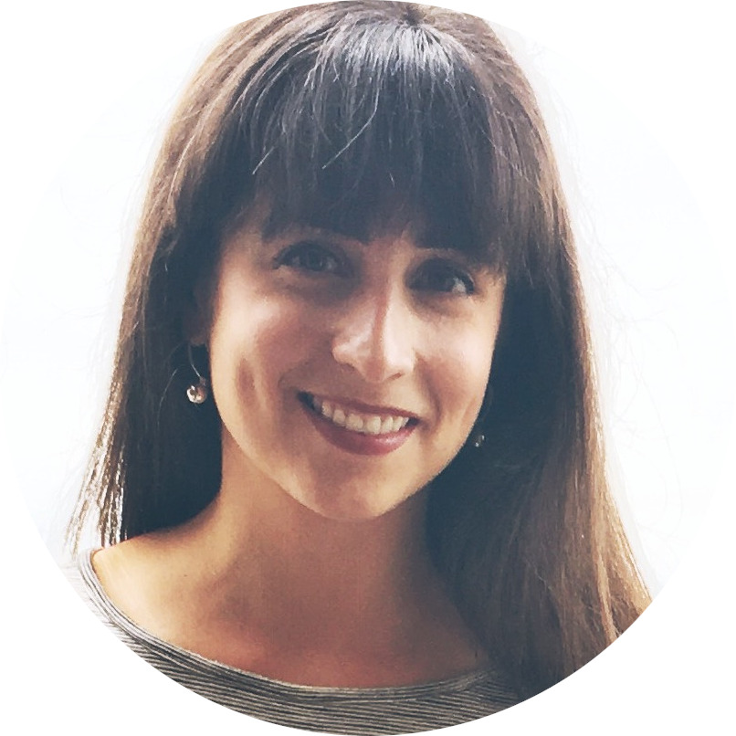

I am an ecologist working as a Postdoctoral Researcher in Mark van Kleunen's lab in the Department of Biology at the University of Konstanz. I am broadly interested in the role of cultivation in plant invasion and the influence of interaction networks on structure and function in communities. I maintain diverse interests in species interactions, macroecological patterns, research synthesis methods, and biology education research.

