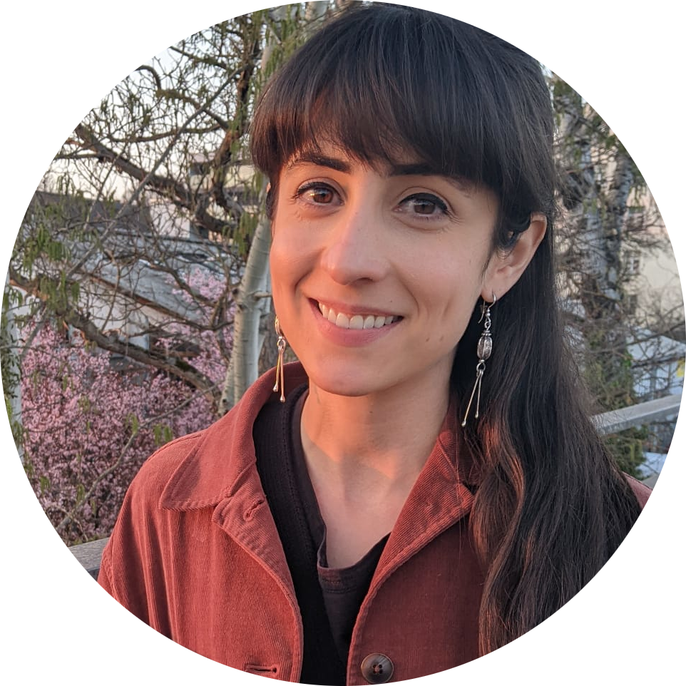

I am an ecologist working as a postdoctoral researcher in Mark van Kleunen's lab at the University of Konstanz. I study the role of cultivation in plant naturalization and invasion and the influence of interaction networks on structure and function in communities. I maintain diverse interests in species interactions, macroecological patterns, research synthesis methods, and biology education research.

