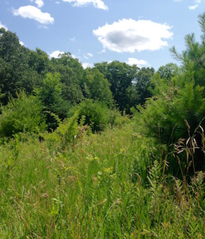
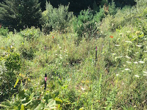
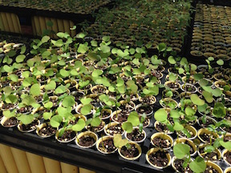

**Research keywords**

*plant community ecology, species interactions, biological invasions, spatial simulations, meta-analysis, network ecology, Bayesian hierarchical modeling*

**Dissertation work**

*Meta-analysis of plant interaction networks*

I characterized plant communities as networks and combined network metrics using meta-analysis to make generalizations about plant community structure with a quantitative foundation.

*Fieldwork and greenhouse experiments of plant interactions*

I conducted large scale field and garden experiments in an old field woody plant community with native and invasive species in order to quantify community-level interaction structure using network theory.

I also measured pairwise and three-species interactions among invasive and native woody old field plants in greenhouse experiments to determine whether pairwise interactions can predict three-species interactions.

*Spatial simulations of invaded plant communities*

We used stochastic spatial lattice simulations of plant community dynamics to understand what aspects of community structure influence invasibility and what invader characteristics influence invasiveness. These simulations were carried out using a parallelized C++ program that I co-wrote, [ecolattice](https://github.com/dsjamieson/ecolattice).

**Other projects**

+ I have led and been a part of several meta-analyses to quantify evidence and to document patterns about well-known ecological phenomena, including the latitudinal diversity gradient and the correlation between native and exotic species richness at many spatial scales and extents. I'm generally interested in how meta-analysis can be used to answer ecological questions, especially by using hierarchical meta-analytic models to partition variation.

+ I've helped design undergraduate biology teaching and assessment materials that are structured using the core concepts of AAAS Vision and Change Undergraduate Biology Education Initiative. We specifically focus on pathways and transformations of matter and energy, a concept crucial for understanding current issues like climate change.

+ I've worked with a team designing and implementing a population dynamic simulation, informed by bioenergetic models, that estimates the impacts of invasive carp on native paddlefish in the Mississippi River.

+ I was a part of a project assessing the potential risk of biological invasions on green roofs, including the risk of planted invasive plants spreading from green roofs as well as the risk of invasive plants dispersing to and establishing on green roofs.

+ I quantified the diversity of macroinvertebrate communities in small ponds within a human-dominated urban/suburban matrix, in detention ponds as well as created and natural wetlands.

 

 

*Images of my field site in the Yale Myers Forest in northeastern Connecticut, an old field with a patchy mixture of native and invasive shrubs, along with plenty of forbs and grasses (also featured:* Berberis thunbergii *seedlings in the greenhouse).*
